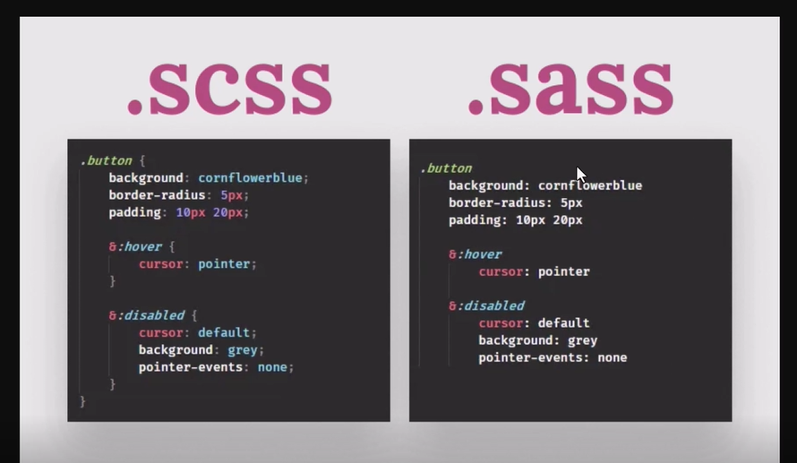
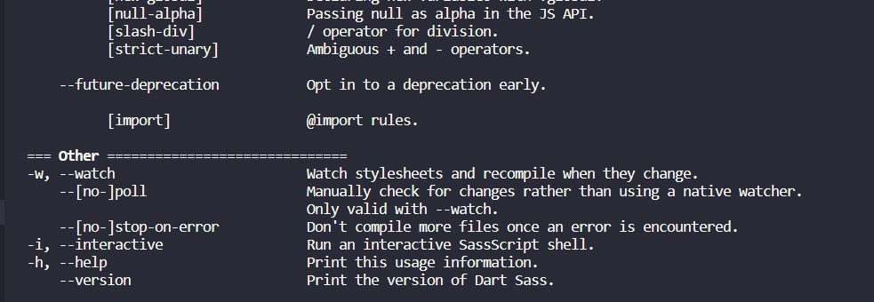

#Buổi 1: 
Sass:
    - styles.scss
    - styles.sass
- Sự khác biệt cú pháp giữa hai đuôi scss và sass 
    

- Cú pháp để dùng các câu lệnh của scss là scss -h
- Biến đổi scss thành file css dùng câu lệnh: ```sh sass <input.scss> [output.css] ```
- Biến đổi tất cả các file trong thư mục scss sang thư mục css bằng câu lệnh: ```sh sass <input.scss>:<output.css> <input/>:<output/> <dir/> ```
- Sử dụng -w để theo dõi sự thay đổi của file scss và cập nhập lại là dùng -w
- Những lệnh của sass:
    
    