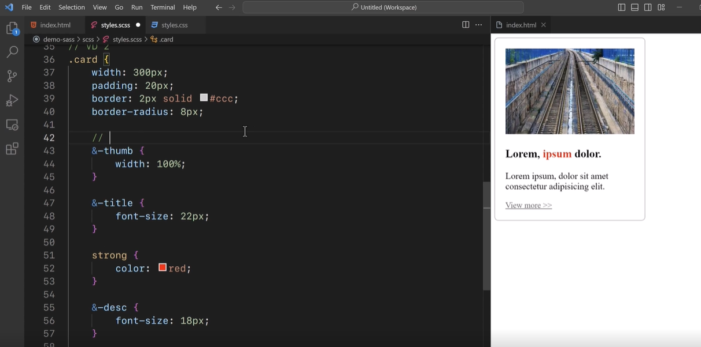

- Về cú pháp:
    +  
    + Dấu & được gọi là Parent selector
    + Có một cách viết ngắn gọn các thuộc tính là
        * Viết bình thường:
     
        * Rút gọn:
     
- Biến: 
```sh
    $ + tên biến : value;
```
 + Biến trong Sass có 2 phạm vi:
    * Global: Có thể truy cập trong toàn bộ file Sass kể từ khi khai báo.
    * Local: Chỉ truy cập được trong phạm vi cặp ngoặc { } tại nơi khai báo biến.
 + Phạm vi global còn gọi là “toàn cục”, và phạm vi local còn gọi là “cục bộ”.
 + Sử dụng biến CSS trong Sass
 
- Css selector

