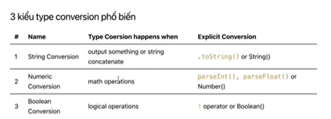

## TỔNG QUAN VỀ BOOLEAN
--> Boolean là một kiểu dữ liệu primitive  và chỉ có giá trị true hoặc false.\\\
--> Mỗi kiểu dữ liệu đều có sẵn cho mình một object. Trong object chứa các phương thức để thao tác với kiểu dữ liệu đó.
### 1. Type conversion vs Type coercion
- Điểm tương đồng là đều chuyển đổi dữ liệu từ kiểu này sang kiểu khác.
- Type coersion (implicit coersion) là ép kiểu tự động(ép kiểu ngầm).
- Type conversion (explicit conversion ) mang ý nghĩa là có thể là ép kiểu tự động như type coersion hoặc ép kiểu tường minh(explicit, tức do mình chỉ định nó ép kiểu)

### 2. Truthy and falsy
- Truthy: là những giá trị khi chuyển đổi về boolean thì sẽ được giá trị true
- Falsy: là những giá trị khi chuyển đổi về boolean thì sẽ được giá trị false
- Các giá trị của falsy
    - false
    - underfile
    - 0, -0, 0n
    - '', "", ``
    - null
    - NaN
    - document.all

### 3. Logical Operators (Toán tử luận lý)
- Mình có 3 logical operators cơ bản: AND, OR và NOT

| Operator |  Desc      |
|:---------| :----------|
| &&       |  AND       |
| \|\|     |  OR        |
| !        |  NOT       |
| !!       |  NOT NOT   |

### 4. Comparison operators
- So sánh cùng kiểu dữ liệu
- So sánh khác kiểu dữ liệu
- So sánh với null/underfile
- Trong JavaScript, khi so sánh với undefined, một số giá trị sẽ trả về true nếu chúng được so sánh với undefined. Cụ thể:
    + null: Khi so sánh null == undefined, kết quả sẽ là true. Điều này là do null và undefined được coi là như nhau trong phép so sánh.

    + undefined: So sánh undefined == undefined hoặc undefined === undefined cũng sẽ trả về true, bởi vì cả hai đều đại diện cho cùng một giá trị.

    + Biến không được khai báo hoặc không tồn tại: Nếu bạn so sánh một biến không được khai báo hoặc không tồn tại với undefined, kết quả cũng sẽ là true. Điều này là do khi bạn so sánh một biến không tồn tại với undefined, JavaScript coi cả hai đều là undefined.
- Tất cả các giá trị so sánh với NaN đều bằng false
- Phép so sánh với null sẽ trả về true trong JavaScript:
    + null == null: So sánh null với chính nó.
    + null == undefined: So sánh null với undefined.
    + null <= 0: So sánh null với số 0.
    + null >= 0: So sánh null với số 0.
    + null >= '': So sánh null với chuỗi rỗng ''.
    + null < = '': So sánh null với chuỗi rỗng ''.
- Khi so sánh khác kiểu dữ liệu, js sẽ tự động convert giá trị về dạng number để so sánh

--> Để biết khi so sánh các giá trị sẽ convert sang giá trị gì thì tra bảng sau: https://getify.github.io/coercions-grid/

