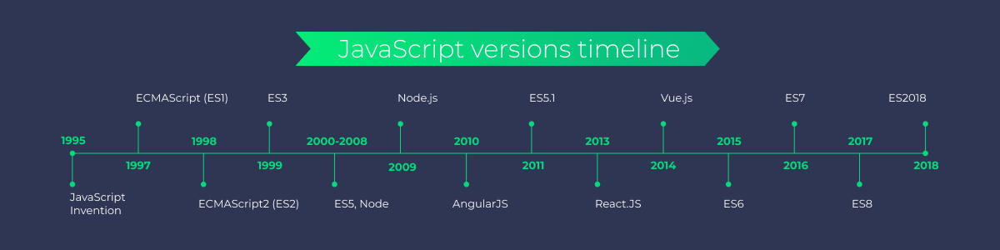
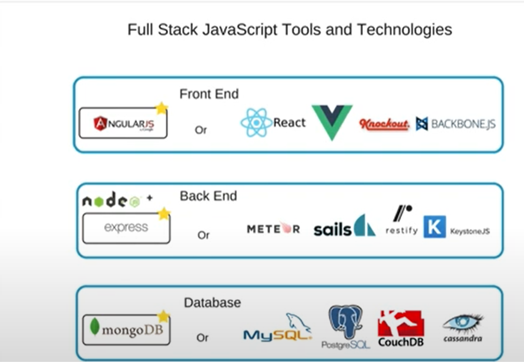
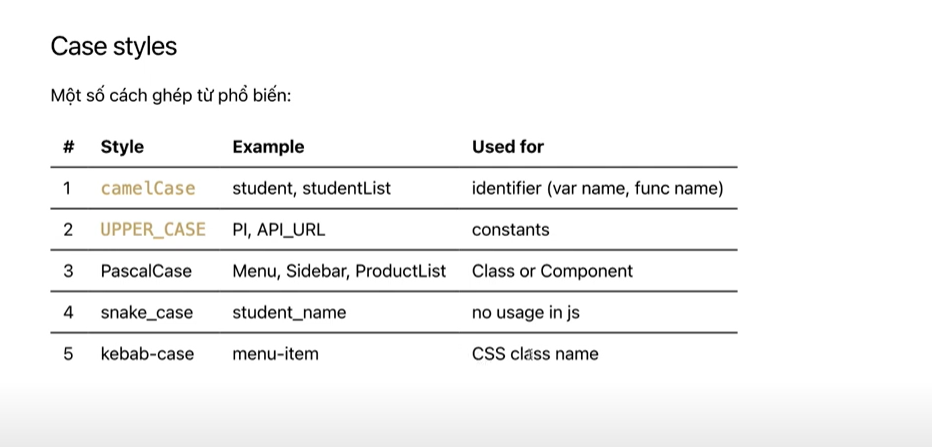
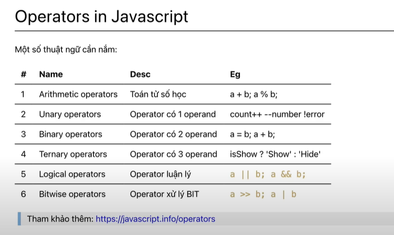
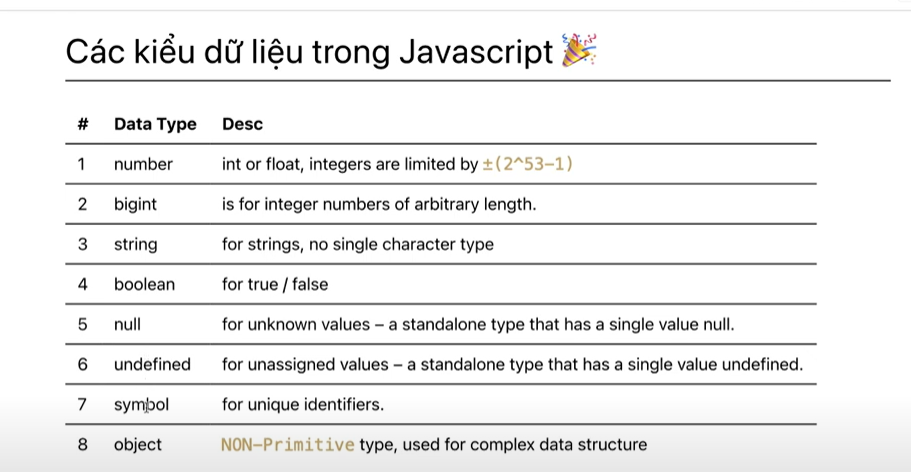
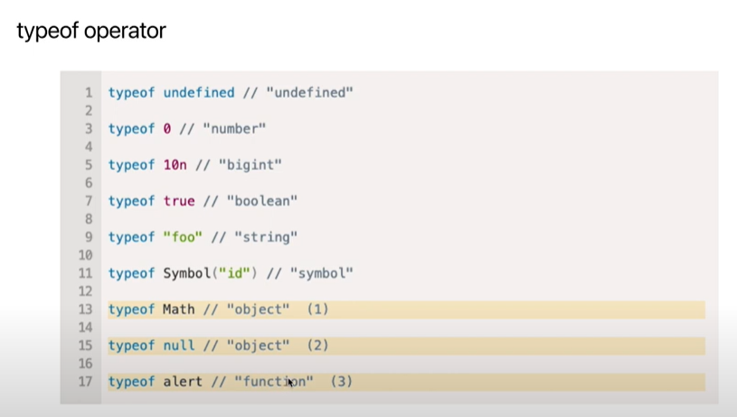

### 1. Hình ảnh minh họa về lịch sử phát triển của javasript

### 2. ES... là từ viết tắt của ECMAScript và ECMAScript là tài liệu đặc tả của ngôn ngữ và Javascript là được xây dựng dựa trên đặc tả đó

### 3. Javascript có thể làm gì

### 4. Syntax là bộ quy tắc hình thành nên một ngôn ngữ lập trình. 
### 5. Reserved keyword là những từ khóa đặc biệt trong Javascipt như: break, continue,...
--> Tham khảo: https://www.w3schools.com/js/js_reserved.asp
### 6. Biến là nơi lưu trữ giá trị tạm thời lên bộ nhớ
### 7. Cách đặt tên biến
- Dùng Tiếng Anh
- Đặt tên để biết biến đó chứa giá trị gì.
- Không đánh đố nhau, đặt tên một đằng lưu giá trị một nẻo
- Với true/false, đặt tên với prefix(tiền tố) has hoặc is hoặc show hoặc mang ý nghĩa chỉ có nhận giá trị true hoặc false.
- Còn lại thì dùng danh từ.
- Với dạng danh sách thì thêm suffix List

### Operators trong Javascript

### Các kiểu dữ liệu trong Javascript

