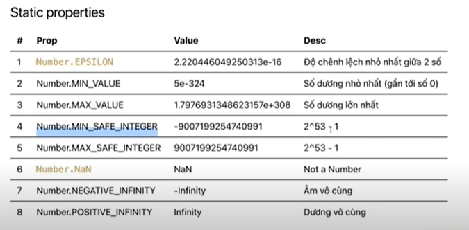

## Tổng quan về number
### 1. Giới thiệu về kiểu number
- Có 2 loại số
    + Integer(int): số nguyên (1,2,3,...)
    + Float(float): số thực (1.5, 2.5, 3.7,...). Dùng dấu chấm để ngăn phần thập phân.
- Lưu ý: Javascript chỉ có một kiểu dữ liệu là number dùng cho cả số nguyên và số thực.
- Number trong JS được lưu dưới dạng double-precision 64-bit binary format IEE 754 
- Static properties

- Toán tử số học (Arithmetic operators)
- Toán tử gán (Assignment operators)
- Chuyển đổi số thành chuỗi:
```sh
    toString(base|| radix): với base or radix là hệ số: 2, 8, 16, 10
    n.toString(); // '20' (default is 10)
    n.toString(10); // '20' Decimal
    n.toString(16); // '14' Hexadecimal
    n.toString(8); // '24' Octal
    n.toString(2); // '10100' Binary
```

### 2. Number - A primitive wrapper object
- Use Number as a function
- When used as a function, Number(value) converts a string or other value to the Number type. If the value can't be converted, it returns NaN
```sh
    Number(123); // 123
    Number('123'); // 123
    Number('abc'); // NaN
```

### 3. Math - Built-in object for mathematical constants and functions
- [x] Math is a built-in object that has properties and methods for mathematical constants and functions. It's not a function object.

**- Các props phổ biến**

|#  | Prop       | Desc|
|:--|  :--       |:----|
|1  | Math.PI    | Giá trị của PI, khoảng 3.14159|
|2  | Math.SQLT2 | Giá trị của căn bậc 2 của 2 ~ 1.414|

**- Các methods phổ biến**

|#  | Prop              | Desc                              |
|:--|  :--              |:----                              |
|1  | Math.ceil(x)      | Làm tròn lên số nguyên gần nhất   |
|2  | Math.floor(x)     | Làm tròn xuống số nguyên gần nhất |
|3  | Math.round(x)     | Làm tròn tới số nguyên gần nhất   |
|4  | Math.trunc(x)     | Lấy phần nguyên, bỏ phần thập phân|
|5  | Math.random()     | Random số thực từ 0 --> 1         |
|6  | Math.abs(x)       | Lấy giá trị tuyệt đối             |
|7  | Math.pow(x,y)     | Hàm lũy thừa, x^y                 |
|8  | Math.sqrt(x)      | Hàm căn bậc 2                     |   

**- Imprecise 
Caculations(Sai số)**
```sh
    console.log((0.1).toFixed(20));
    console.log((0.2).toFixed(20));
    console.log((0.1 + 0.2).toFixed(20));
    console.log((0.3).toFixed(20));

    console.log(0.1 + 0.2 - 0.3);
    console.log(0.1 + 0.2 === 0.3);
    console.log(Math.abs(0.1 + 0.2 - 0.3) < Number.EPSILON);
    console.log((0.1 + 0.2).toFixed(1) === (0.3).toFixed(1));
```
- Lưu ý
    + Không phải số nào cũng được lưu chính xác trong JS(thực ra việc này cũng xảy ra ở những ngôn ngữ khác do dùng chung chuẩn lưu dữ liệu)
    + Khi làm việc với thực cần lưu ý về vấn đề này để xử lý chúng
    + So sánh số thực bằng nhau thì dùng hằng số EPSILON hoặc toFix() để làm tròn số trước khi so sánh nhé