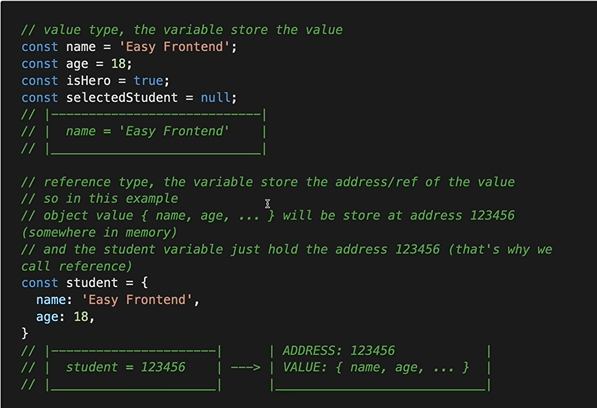

## OBJECT

### Khai báo object (là kiểu precedence type)
- [x] Với các loại dữ liệu mình đã biết như number, string, boolean, nó chỉ là một giá trị đơn giản.
- [x] Nhưng với object là kiểu dữ liệu có thể chứa nhiều dữ liệu khác nhau thông qua các **key, value** 
- [x] value có thể là kiểu dữ liệu bất kỳ: number, string, boolean, object, array, function,...

```sh
const person = {
    name: 'Trang',
    age: '21'
}
```

### Lấy value của key
- [x] Dùng dot operator để truy cập key của object
- [x] Dùng square brackets để truy cập dynamic key của object, kể cả key có space.

### Thêm key mới cho object
```sh
 const student = {
    id: 1,
    name: 'Trang',
    isHero: true
 }
 
 // update value of a key
 student.name = 'Nguyen Thi Trang';

 // simply set new key for object
 student.age = 18;
 student['mark'] = 10;
```

### Xóa một key
- [x] Để xóa một key ra khỏi object hiện tại, dùng delete operator

```sh
 delete student.name
```

### Tham trị và tham chiếu

| # |  Name                         | Data Type                                             |
|:--| :--                           | :--                                                   |
| 1 | Primitive Type / Value Type   | boolean, number, string, null, underfile, sysbol      |
| 2 | Reference Type                | object, array, function                               |

- [x] Pass by value vs Pass by reference
```sh
 function changePrimitive(name, age)
 {
    name = 'Easy Frontend';
    age = 18;
 }
 
 let name = 'Trang';
 let age = 21;
 changePrimitive(name, age);

 console.log(name); // 'Trang'
 console.log(age); // 21

 function changeReference(student)
 {
    student.name = 'Trang';
    student.age = 18;
 }

 const student = {
    name: 'Easy',
    age: 17
 }
 changeReference(student);
```

### Một số thao tác cơ bản với object
#### Đặt tên cho key
- Với tên biến / tên function thì không được dùng reserved keywords.
- Còn với tên key của object thì thoải mái, kể cả reserved keywords, nhưng không khuyến khích sử dụng
- Property value shorthand
```sh
const name = 'Easy Frontend';
const age = 18;

const student = {
    name: name,
    age: age
}

// shorthand (recommended)
const student = {
    name,
    age
}
```

### Object destructuring
```sh
const student3 = {
    name3: 'Easy Front'
    age3: 18
}

// old way
const name3 = student3.name3;
const age3 = student3.age3;

// new way usign object destructuring
const {name3, age3} = student; // recommended
```

#### Kiểm tra key có trong object không?
- Dùng **in** operator để kiểm tra một key có tồn tại trong object không

```sh
const student5 = {
    name: 'Trang',
    age: 18
}

'name' in student5; // true
'age' in student5; // true
'isHero' in student5; // false
```

#### Clone object
```sh
const student6 = {
    name: 'Easy Frontend',
    age: 18
}

const moreProps = {
    isHero: true,
    gender: 'male'
}

// v1: using Object.assign()
const cloneStudent6 = Object.assign({}, student6, moreProps)

// v2: using spread operator(shorter, easier to read)
const cloneStudent2 = {
    ...student,
    ...moreProps
}
```

#### Deep clone object

- Với object có 1 tầng, 2 tầng thì có thể làm việc như trên, còn nếu nhiều tầng hơn thì nên sử dụng thư viện. Tham khảo thư viện sau: https://github.com/immerjs/immer 

### Duyệt key của object
- [x] Để lấy tất cả key trong object thì dùng method: **Object.keys()**
- Nên dùng for... in để duyệt keys của object