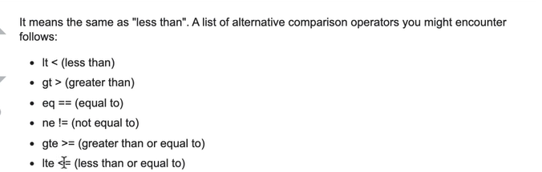

- Media queries 
    + Kích thước PC >= 1024px
    + Tablet: >= 740px & < 1024px
    + Mobile: < 740px
- Responsive là kỹ thuật giúp website hiển thị tương thích với nhiều kích thước màn hình khác nhau (Mobile, tablet, PC,...)
- Tối ưu trải nghiệm người dùng:
1. Hiển thị rõ ràng các thành phần(hình ảnh, cỡ chữ, nút bấm,...)
2. Ẩn / hiện các thành phần phù hợp theo kích thước màn hình
- Khái niện niệm Viewport
- Media query?
```sh
@media not|only mediatype and (mediafeature and|or|not mediafeature)
{
    CSS-Code;
}
```
1. Keywords:
- not: loại trừ (vd: not A nghĩa là loại A)
- only: chỉ (vd: only A nghĩa là chỉ áp dụng với thằng A)
- and
- or

2. Mediatypes:
- print: css cho chế độ in
- screen: css cho chế độ màn hình
- speech: css cho màn hình nói được
- all-defaull

3. Media Features:
- Min-width
- Max-width
-...

4. Polyfill là thuộc tính giúp cho các trình duyệt cũ có thể sử dụng được media query, tham khảo ở trang sau: https://github.com/scottjehl/Respond?tab=readme-ov-file, https://en.wikipedia.org/wiki/Conditional_comment
```sh
<!--[if lt IE 9]>
<script src="https://cdnjs.cloudflare.com/ajax/libs/respond.js/1.3.0/respond.min.js" integrity="sha512-BWbLJlfp8hzXlxT6K5KLdxPVAj+4Zn2e4FVq5P7NSFH/mkAJ18UiZRQUD4anR3jyp0/WYkeZ0Zmq5EWWrDxneQ==" crossorigin="anonymous" referrerpolicy="no-referrer"></script>
<![endif]-->
```
- lt có thể thay thành nhiều loại khác nhau như trong hình sau:


5. Breakpoints là những điểm/ vị trí mà bố cục website sẽ thay đổi - thích ứng để tạo nên giao diện responsive

6. Chúng ta nên sử dụng đơn vị: em để responsive trang web 